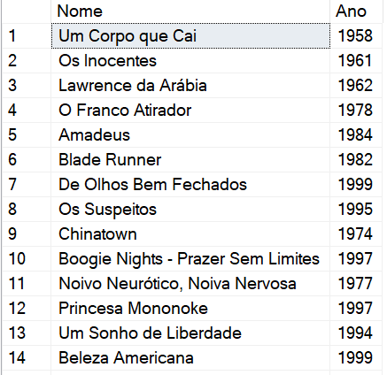
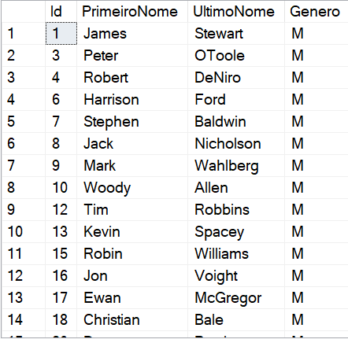
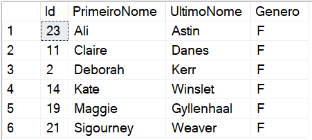

# DIO - Trilha .NET - Banco de Dados
www.dio.me

## Desafio de projeto
Para este desafio, você precisará usar seus conhecimentos adquiridos no módulo de banco de dados, da trilha .NET da DIO.

## Contexto
Você é responsável pelo banco de dados de um site de filmes, onde são armazenados dados sobre os filmes e seus atores. Sendo assim, foi solicitado para que você realize uma consulta no banco de dados com o objetivo de trazer alguns dados para análises.

## Proposta
Você precisará realizar 12 consultas ao banco de dados, cada uma retornando um tipo de informação.
O seu banco de dados está modelado da seguinte maneira:


As tabelas sao descritas conforme a seguir:

**Filmes**

Tabela responsável por armazenar informações dos filmes.

**Atores**

Tabela responsável por armazenar informações dos atores.

**Generos**

Tabela responsável por armazenar os gêneros dos filmes.

**ElencoFilme**

Tabela responsável por representar um relacionamento do tipo muitos para muitos entre filmes e atores, ou seja, um ator pode trabalhar em muitos filmes, e filmes
podem ter muitos atores.

**FilmesGenero**

Tabela responsável por representar um relacionamento do tipo muitos para muitos entre filmes e gêneros, ou seja, um filme pode ter mais de um gênero, e um genêro pode fazer parte de muitos filmes.

## Preparando o banco de dados
Você deverá executar o arquivo **Script Filmes.sql** em seu banco de dados SQL Server, presente na pasta Scripts deste repositório ([ou clique aqui](Script%20Filmes.sql)). Esse script irá criar um banco chamado **Filmes**, contendo as tabelas e os dados necessários para você realizar este desafio.

## Objetivo
Você deverá criar diversas consultas, com o objetivo de retornar os dados a seguir. Abaixo de cada pedido tem o retorno esperado. O seu retorno deve ser igual ao da imagem.

## Atenção
Neste README já está respondido com todas as questões abaixo.

## 1 - Buscar o nome e ano dos filmes



```sql
SELECT Nome, Ano
	FROM Filmes
```

## 2 - Buscar o nome e ano dos filmes, ordenados por ordem crescente pelo ano


```sql
SELECT Nome, Ano, Duracao
	FROM Filmes
	ORDER BY Ano ASC
```

## 3 - Buscar pelo filme de volta para o futuro, trazendo o nome, ano e a duração


```sql
SELECT Nome, Ano, Duracao
	FROM Filmes 
	WHERE Nome = 'De volta para o Futuro'
```

## 4 - Buscar os filmes lançados em 1997


```sql
SELECT Nome, Ano, Duracao
	FROM Filmes
	WHERE Ano = 1997
```

## 5 - Buscar os filmes lançados APÓS o ano 2000


```sql
SELECT Nome, Ano, Duracao
	FROM Filmes
	WHERE Ano > 2000
```

## 6 - Buscar os filmes com a duracao maior que 100 e menor que 150, ordenando pela duracao em ordem crescente


```sql
SELECT Nome, Ano, Duracao
	FROM Filmes
	WHERE Duracao > 100 AND Duracao < 150
	ORDER BY Duracao ASC
```

## 7 - Buscar a quantidade de filmes lançadas no ano, agrupando por ano, ordenando pela duracao em ordem decrescente


```sql
--OBS: Está com o enunciado errado: O enunciado diz uma coisa mas a query faz outra.
SELECT Ano, COUNT(*) AS Quantidade
	FROM Filmes
	GROUP BY Ano
	ORDER BY Quantidade DESC
```

## 8 - Buscar os Atores do gênero masculino, retornando o PrimeiroNome, UltimoNome



```sql
SELECT * FROM Atores
	WHERE Genero = 'M'
```

## 9 - Buscar os Atores do gênero feminino, retornando o PrimeiroNome, UltimoNome, e ordenando pelo PrimeiroNome



```sql
SELECT * FROM Atores
	WHERE Genero = 'F'
	ORDER BY PrimeiroNome ASC
```

## 10 - Buscar o nome do filme e o gênero


```sql
SELECT f.Nome, g.Genero FROM Filmes f
	INNER JOIN FilmesGenero fg ON f.Id = fg.IdFilme
	INNER JOIN Generos g ON fg.IdGenero = g.Id
```

## 11 - Buscar o nome do filme e o gênero do tipo "Mistério"


```sql
SELECT f.Nome, g.Genero FROM Filmes f
	INNER JOIN FilmesGenero fg ON f.Id = fg.IdFilme
	INNER JOIN Generos g ON fg.IdGenero = g.Id
	WHERE g.Genero = 'Mistério'
```

## 12 - Buscar o nome do filme e os atores, trazendo o PrimeiroNome, UltimoNome e seu Papel


```sql
SELECT f.Nome, ato.PrimeiroNome, ato.UltimoNome, ef.Papel FROM Filmes f
	INNER JOIN ElencoFilme ef ON f.Id = ef.IdFilme
	INNER JOIN Atores ato ON ef.IdAtor = ato.ID
```
